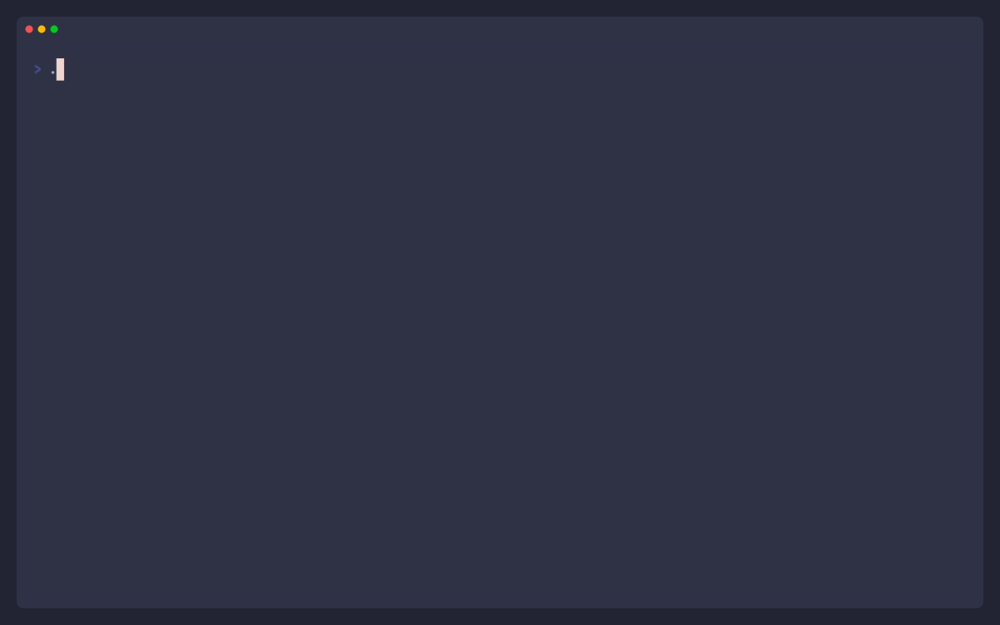
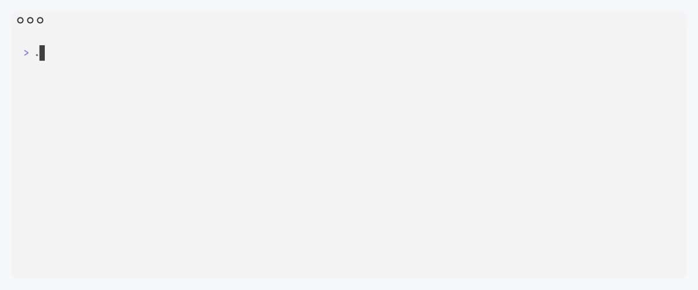

[](https://www.blazingly.fast)

# 🧢 nocap-crypt: Make Userspace Great Again (MUGA)

> **Blazingly fast, unprivileged `cryptsetup` replacement for AES-XTS & AES-CBC volume encryption.**

Ever tried to run `cryptsetup` inside a Docker container for your embedded CI/CD pipeline, only to be slapped with `Operation not permitted`? 

The kernel elites have been lying to you. They want you to believe you need `--privileged`. They want you to beg for `CAP_SYS_ADMIN`. They want to trap your CI/CD pipelines in bloated `dm-crypt` bureaucracy. 

**Not anymore. We say: No CAP.**

`nocap-crypt` is a pure userspace `cryptsetup` alternative built specifically for CI/CD pipelines. It performs XTS and CBC AES ciphering of volumes (`squashfs`, `ext4`), fully supporting the classic **`cryptsetup --plain` (headerless)** format. It rips volume encryption out of Ring 0 and puts it where it belongs: unprivileged userspace.

---

## 🎥 The Flex
*(Watch the tinfoil hat go up as we bypass the kernel)*

<p align="center">
  
</p>

---

## 🦅 Features

`nocap-crypt` isn't just a cryptographic wrapper; it's a terminal experience engineered to flex raw hardware dominance.

* 🚀 **Zero Kernel Dependencies:** Bypasses `dm-crypt` entirely. Runs flawlessly in completely unprivileged Docker/Podman containers.
* 🌪️ **Hardware Accelerated:** Detects your architecture and aggressively utilizes CPU instructions (`AES-NI` for x86_64, `ARMv8 Crypto Extensions` for AArch64).
* 🛡️ **`--plain` Compatibility:** Drop-in support for headerless XTS-AES (the modern standard) and CBC-AES (the old `cryptsetup` default).
* 🦀 **Math-Aware Multi-Threading:** XTS encryption is split across all CPU cores instantly via Rust's `rayon`. *(Note: CBC encryption is mathematically sequential by definition and cannot be parallelized, but we optimize the hell out of the AES-NI pipeline anyway).*
* 🇺🇸 **Drain The Swamp:** Keep your cryptography in Ring 3.

## 📦 Installation

```bash
cargo install nocap-crypt
```
Or build directly from source:
```bash
git clone https://github.com/david-sterling/nocap-crypt.git
cd nocap-crypt
cargo build --release
```

## 🛠️ Usage

### 1. The Standard Run (XTS)
Encrypt a headerless volume fast and efficiently using modern XTS.
```bash
nocap-crypt wrap ./target.sqfs --cipher xts-aes-256 --keyfile secret.key
```

### 2. The Legacy Mode (CBC)
Need the classic `cryptsetup --plain` behavior with Cipher Block Chaining? We support that too.
```bash
nocap-crypt wrap ./legacy_fs.ext4 --cipher cbc-aes-256 --keyfile secret.key
```

### 3. The Redpill (`--redpill`)
Wake up, Anon. Enable the full paranoid Apu / Pepe UI matrix. Cycle through the Tech Deep State acronyms as your userspace cryptography bypasses Ring 0.
```bash
nocap-crypt wrap ./firmware.sqfs --redpill
```

---

## 🤖 CI Mode (`--ci`)

No ASCII art, no jokes, no interactive redraw — just line-by-line timestamped logs your pipeline can actually parse, ending in a colored pass/fail banner. This is what a `nocap-crypt` step looks like in a GitHub Actions / GitLab CI log viewer.

<p align="center">
  
</p>

```bash
nocap-crypt --ci image encrypt --input target.sqfs --output target.sqfs.enc --key-file secret.key
```

`--ci` also drives a fully standalone, environment-variable-configured invocation (no subcommand needed) — see `NOCAP_CRYPT_*` in the CLI's own `--help` output.

---

## 👔 For Managers, CTOs, and "Governance" Experts

Are you a manager worried about incorporating a tool called `nocap-crypt` into your CI/CD pipeline? Does the phrase "Make Userspace Great Again" frighten your shareholders? Don't worry.

**`nocap-crypt` strictly follows mathematical standards.**

*   **XTS Mode:** Aligned with **NIST SP 800-38E**.
*   **CBC Mode:** Aligned with **NIST SP 800-38A**.

By using `nocap-crypt`, you achieve enterprise-grade volume encryption without the catastrophic `CAP_SYS_ADMIN` capability risks associated with traditional containerized `dm-crypt`.

### The Boss Key (`--governance`)
If you need to take a screenshot for Jira to prove compliance to your CISO, pass the `--governance` flag. It turns off all MUGA/4chan UI, disables the ASCII animations, and formats the output into a sterile, overpriced-enterprise-tier log — safe to screenshare.

<p align="center">
  
</p>

```bash
nocap-crypt --governance image encrypt --input target.sqfs --output target.sqfs.enc --key-file secret.key
```

### ⚖️ Official Lab Validation Disclaimer
*(Legal Disclaimer: None of these NIST SP 800 claims have been validated by an official government laboratory. We did some basic testing on our end and the math checks out, but please don't sue us if Chad from Compliance asks for a literal FIPS certificate. We are a Pepe-themed CLI tool, sir. Furthermore, while `nocap-crypt` guarantees cryptographic execution, it cannot stop your frontend team from committing production AWS keys to public repositories. You're on your own for that one.)*

---

## 🤝 Contributing
Want to add a new block cipher? Want to add a new Pepe frame? 
Pull Requests are welcome. 

**Where We Encrypt One, We Encrypt All.**
